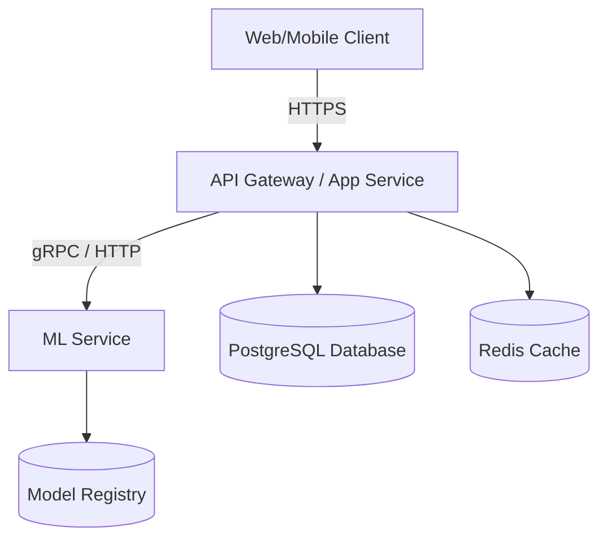

# ScamGuard - AI-Powered Cybersecurity Intelligence Platform

## Introduction
ScamGuard is an advanced, AI-driven cybersecurity intelligence platform designed to protect organizations and users from sophisticated digital threats, phishing campaigns, and fraudulent activities. It leverages cutting-edge machine learning and real-time scanning capabilities to identify, analyze, and neutralize scams before they cause harm.

## Core Features
- **Explainable AI**: Understand exactly why a threat was flagged with detailed, transparent AI reasoning.
- **Multi-Channel Scanners**: Comprehensive scanning across email, SMS, web, and social media channels.
- **Enterprise Admin**: Robust administrative controls, user management, and organization-wide security policies.
- **Premium Exports**: Generate detailed, compliance-ready reports and export data for further analysis.

## Architecture



## Setup Guide

### Option 1: Docker Compose (Recommended)
1. Ensure Docker and Docker Compose are installed on your system.
2. Clone the repository and navigate to the project root.
3. Start the application:
   ```bash
   cd infra
   docker-compose up -d --build
   ```
4. Access the application at `http://localhost:3000` (frontend), the API at `http://localhost:8000` (app_service), and `http://localhost:8002` (ml_service).

### Option 2: Local Python/Node Setup
1. **App Service (Python)**:
   - Navigate to the `backend` directory.
   - Install dependencies: `pip install -r requirements.txt`
   - Run migrations: `alembic upgrade head` (or use sqlite default)
   - Start the server: `uvicorn app_service.main:app --port 8000 --reload`
2. **ML Service (Python)**:
   - In a new terminal, navigate to the `backend` directory.
   - Start the ML service: `uvicorn ml_service.main:app --port 8002 --reload`
3. **Frontend (Node)**:
   - Navigate to the `frontend` directory.
   - Install dependencies: `npm install`
   - Start the dev server: `npm run dev`

## Environment Variables

For local development without Docker, use the following environments:

**Backend (`backend/.env`)**
Copy `backend/.env.example` to `backend/.env` and generate a secure `SECRET_KEY`.

**Frontend (`frontend/.env.local`)**
Copy `frontend/.env.example` to `frontend/.env.local`. It defaults to:
```env
APP_SERVICE_URL=http://127.0.0.1:8000
```

## Troubleshooting and Deployment

### Troubleshooting
- **Database Connection Issues**: Ensure PostgreSQL is running and the `DATABASE_URL` is correct. If using Docker, verify the DB container is healthy. The default development setup uses SQLite.
- **Model Loading Errors**: Ensure the ML service has access to the model artifacts directory and sufficient memory.

### Live Demo
The application is currently deployed via Serveo for public access.
- **Frontend / Live Demo URL**: [https://13243a1b972683b1-103-40-80-2.serveousercontent.com](https://13243a1b972683b1-103-40-80-2.serveousercontent.com)
- **Backend API Base**: [https://13243a1b972683b1-103-40-80-2.serveousercontent.com/backend-api](https://13243a1b972683b1-103-40-80-2.serveousercontent.com/backend-api)

### Production Deployment (Docker Compose)
1. Navigate to `infra/`
2. Copy `infra/.env.example` to `infra/.env` and update the secrets (e.g. `POSTGRES_PASSWORD`, `SECRET_KEY`).
3. Run `docker compose up -d --build`. This will start the App Service, ML Service, Frontend, PostgreSQL DB, and Nginx reverse proxy.
4. Access the application on port 80.
